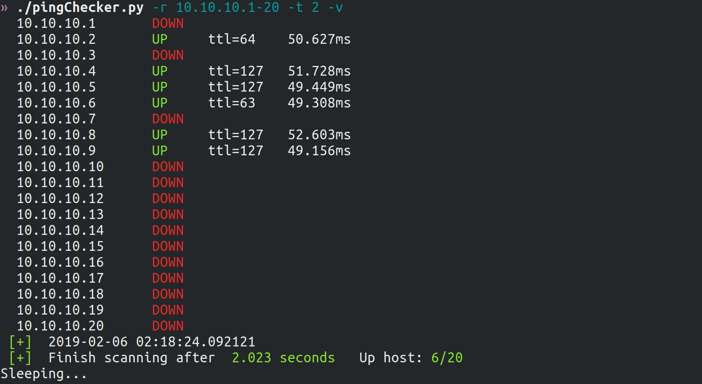

# pingChecker

A basic python program perfoms ping check on a given list of IP

## Installing

Just a standalone python2 file.

## Usage

```
./pingChecker.py -h
usage: pingChecker.py [-h] [-r <RANGE>] [-f <FILE>] [-t <INTERVAL>]
                      [-w <TIMEOUT>] [-c <PACKETS>] [-v]

optional arguments:
  -h, --help     show this help message and exit
  -r <RANGE>     IP Range
  -f <FILE>      Read list of IPs from file
  -t <INTERVAL>  Run periodically, with interval
  -w <TIMEOUT>   Ping timeout, default=2s
  -c <PACKETS>   Number of ping packet, default=1
  -v             Print all hosts

```

### Example on HackTheBox range:

```
./pingChecker.py -r 10.10.10.1-20 -v
 [+]  Start scanning
 [+]  2019-02-06 02:19:29.327821
  10.10.10.1       DOWN
  10.10.10.2       UP     ttl=64    50.499ms
  10.10.10.3       DOWN
  10.10.10.4       UP     ttl=127   48.413ms
  10.10.10.5       UP     ttl=127   48.552ms
  10.10.10.6       UP     ttl=63    48.409ms
  10.10.10.7       DOWN
  10.10.10.8       UP     ttl=127   48.352ms
  10.10.10.9       UP     ttl=127   48.281ms
  10.10.10.10      DOWN
  10.10.10.11      DOWN
  10.10.10.12      DOWN
  10.10.10.13      DOWN
  10.10.10.14      DOWN
  10.10.10.15      DOWN
  10.10.10.16      DOWN
  10.10.10.17      DOWN
  10.10.10.18      DOWN
  10.10.10.19      DOWN
  10.10.10.20      DOWN
 [+]  2019-02-06 02:19:31.357296
 [+]  Finish scanning after  2.0295 seconds   Up host: 6/20

```


## Versioning

0.01

## Authors

Blue